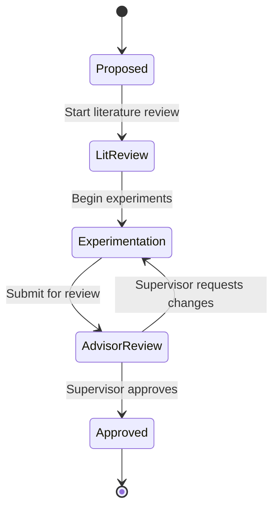

<div align="center">

# 🎓 ScholarSync

### A Real-Time Academic Research Collaboration & Workflow Engine

*Replace scattered emails, chat threads and loose attachments with one unified, auditable research workspace.*


**Spring Boot · REST + WebSocket · Role-Based Access Control · GoF Design Patterns**

*An Advanced Object-Oriented Programming Lab Project*

</div>

---

## 📑 Table of Contents

- [Overview](#-overview)
- [The Problem](#-the-problem)
- [Screenshots](#-screenshots)
- [Core Features](#-core-features)
- [Automated Document Analysis](#-automated-document-analysis)
- [Proposed Feature Extensions](#-proposed-feature-extensions)
- [User Roles](#-user-roles)
- [Task Lifecycle (State Machine)](#-task-lifecycle-state-machine)
- [Design Pattern Architecture](#-design-pattern-architecture)
- [System Architecture](#-system-architecture)
- [Technology Stack](#-technology-stack)
- [Project Structure](#-project-structure)
- [Getting Started](#-getting-started)
- [Configuration](#-configuration)
- [API Documentation](#-api-documentation)
- [Real-Time Events (WebSocket)](#-real-time-events-websocket)
- [Testing](#-testing)
- [Roadmap](#-roadmap)
- [Contributing](#-contributing)
- [License](#-license)
- [Acknowledgements](#-acknowledgements)

---

## 🔭 Overview

**ScholarSync** is a full-stack academic research collaboration platform that brings supervisors and student researchers into a single, structured workspace. It models the real research lifecycle as a **strict, permission-gated state machine**, keeps a **centralized literature vault**, stores every draft as an **immutable, versioned submission**, and broadcasts changes **live over WebSockets**, all backed by a complete **audit trail**.

The backend is an enterprise-grade **Spring Boot** application with clean layering, secured with **Spring Security + JWT + RBAC**, and built around five **Gang of Four design patterns** to demonstrate SOLID, extensible object-oriented design.

---

## ❗ The Problem

Academic collaboration today runs on disconnected tools that were never built for research rigor.

| # | Problem | Description |
|---|---------|-------------|
| 1 | **Fragmented Communication** | Feedback and critical revisions get lost in email threads and chat apps. |
| 2 | **Lack of Visibility** | Advisors have no real-time view of task progress or literature review status. |
| 3 | **Unstructured Lifecycle** | Static to-do lists can't enforce formal academic approval hierarchies. |
| 4 | **Version Chaos** | Draft revisions circulate as standalone attachments with no audit trail. |

ScholarSync solves each of these with four connected modules in one workspace.

---

## 🖼 Screenshots

> Screenshots of the application will be added here.

<!--
Suggested layout once images are ready:

| Login / Register | Research Workspaces |
|:---:|:---:|
|  |  |

| Kanban Board | Version Submission & Analysis |
|:---:|:---:|
|  |  |

| Supervisor Review | Swagger UI |
|:---:|:---:|
|  |  |
-->

---

## ✨ Core Features

### A. Research Milestone & Kanban Engine
A strict state machine, **Proposed → Lit. Review → Experimentation → Advisor Review → Approved**, with **permission-gated transitions**. Tasks live on an interactive Kanban board per research project, and illegal jumps between stages are rejected by the domain model itself.

### B. Literature & Annotation Vault
A centralized reference library that links papers, DOIs and notes. Bibliographies are generated automatically and can be exported in **IEEE**, **APA** and **BibTeX** formats.

### C. Versioned Submission Locker
**Immutable** artifact versioning (`v1.0`, `v1.1`, …) with status-tagged advisor feedback on each revision. Students can upload a **PDF/DOCX** document or submit a **Link/Artifact**, save drafts, and submit new versions. Earlier versions can never be altered, so there is always a trustworthy history.

### D. Real-Time Collaboration & Audit Log
Live **WebSocket** sync of board updates and comments, plus a complete **historical action trail** recording who did what, and when.

### Also included
- 🔐 Secure registration and sign-in with JWT authentication
- 🧑‍🏫 Supervisor dashboard with project, student and active-project counts
- 👥 Assign student researchers to projects and tasks
- 💬 Per-version **supervisor feedback thread**
- ✅ Supervisor decisions on each version: **Approve**, **Reject**, or **Block Under Review**
- 📘 Interactive API documentation via Swagger UI

---

## 🧪 Automated Document Analysis

Every uploaded PDF/DOCX submission is sent to a dedicated **analysis service** (configured via `ANALYSIS_SERVICE_URL`), and the results are displayed on the version in an **Automated Document Analysis Report**.

| Check | What it does |
|-------|--------------|
| **Internal Similarity** | Compares the submission against all other documents already stored in ScholarSync and reports a similarity percentage. |
| **AI Writing Detection** | Uses the Hugging Face `roberta-base-openai-detector` model to estimate the proportion of human-written vs. AI-generated text. |
| **Citation Verification** | Extracts the reference list and verifies each entry against the **Crossref REST API**, reporting total, verified and unverified references. |

---

## 🚀 Proposed Feature Extensions

Additional capabilities that extend ScholarSync beyond the core lab scope:

| Feature | Description |
|---------|-------------|
| **AI-Assisted Literature Summarization** | Auto-generates key-point summaries for uploaded papers to speed up review. |
| **Deadline & Milestone Reminders** | Scheduled notifications for upcoming reviews and submission deadlines. |
| **Advisor Analytics Dashboard** | Visual progress metrics across students, projects and timelines. |
| **Plagiarism & Similarity Pre-Check** | Automated originality scan run before a formal submission is filed. |
| **Multi-Advisor / Co-Author Mode** | Joint supervision and cross-institution collaboration on one project. |

---

## 👤 User Roles

Access is enforced with **Role-Based Access Control (RBAC)**.

| Capability | Student Researcher | Supervisor |
|------------|:-----------------:|:----------:|
| Register / sign in | ✅ | ✅ |
| Create research projects | ❌ | ✅ |
| Assign students to projects | ❌ | ✅ |
| Create and assign tasks | ✅* | ✅ |
| Move tasks through early stages | ✅ | ✅ |
| Submit new versions / save drafts | ✅ | ✅ |
| Approve / reject / block a version | ❌ | ✅ |
| Final approval of a task | ❌ | ✅ |
| Post feedback comments | ✅ | ✅ |
| View audit log | ✅ (own projects) | ✅ |

\* Subject to project membership and configured permissions.

---

## 🔄 Task Lifecycle (State Machine)



Transitions are **permission-gated**: for example, only a supervisor can move a task into **Approved**. Any other transition is rejected by the state objects themselves.

---

## 🧩 Design Pattern Architecture

Five GoF patterns give the domain model structure, extensibility and SOLID compliance.

| Pattern | Application | Benefit |
|---------|-------------|---------|
| **State** | Task lifecycle management | Prevents illegal transitions; adding new stages stays Open/Closed. |
| **Strategy** | Citation export engine | Swaps IEEE / APA / BibTeX formatting at runtime. |
| **Observer** | Real-time notifications & sync | Decouples business logic from WebSocket broadcast & audit logging. |
| **Command / Memento** | Version control & undo/redo | Immutable version history with rollback of research drafts. |
| **Factory** | Notification & activity generation | Centralizes object creation; keeps services single-responsibility. |

---

## 🏛 System Architecture

```
┌──────────────────────────────────────────────────────────┐
│                     Web Client (SPA)                     │
│        Kanban · Vault · Submissions · Live Updates       │
└───────────────┬───────────────────────┬──────────────────┘
                │ REST (JSON / JWT)     │ WebSocket (STOMP)
┌───────────────▼───────────────────────▼──────────────────┐
│                   Spring Boot Backend                    │
│                                                          │
│  Controller Layer   (REST endpoints · WS message maps)   │
│  Security Layer     (Spring Security · JWT · RBAC)       │
│  Service Layer      (State · Strategy · Observer ·       │
│                      Command/Memento · Factory)          │
│  Repository Layer   (Spring Data JPA / Hibernate)        │
└───────────────┬──────────────────────────┬───────────────┘
                │                          │
        ┌───────▼────────┐        ┌────────▼─────────────────┐
        │ PostgreSQL     │        │ Document Analysis Service│
        │ (H2 in dev)    │        │ (HTTP :8000)             │
        └────────────────┘        │ Similarity · AI detect · │
                                  │ Crossref citations       │
                                  └──────────────────────────┘
```

---

## 🛠 Technology Stack

| Layer | Technology |
|-------|------------|
| **Backend** | Spring Boot (Java) |
| **API Layer** | REST + WebSocket (STOMP) |
| **Security** | Spring Security · JWT · RBAC |
| **Persistence** | Spring Data JPA / Hibernate |
| **Database** | PostgreSQL (production) · H2 in-memory (dev & tests) |
| **Docs** | OpenAPI 3.0 / Swagger UI |
| **Frontend** | Single-page web app (Vite dev server, port 5173) |
| **Analysis Service** | Separate HTTP service (port 8000) using Hugging Face `roberta-base-openai-detector` and the Crossref REST API |

---

## 📂 Project Structure

> Adjust folder names to match your repository.

```
ScholarSync/
├── backend/                     # Spring Boot application
│   ├── src/main/java/.../
│   │   ├── config/              # Security, WebSocket, OpenAPI configuration
│   │   ├── controller/          # REST controllers & WebSocket handlers
│   │   ├── domain/              # Entities, enums, state/strategy/command classes
│   │   ├── dto/                 # Request / response objects
│   │   ├── observer/            # Event publishers & listeners
│   │   ├── repository/          # Spring Data JPA repositories
│   │   ├── security/            # JWT filter, user details, RBAC rules
│   │   └── service/             # Business logic
│   ├── src/main/resources/
│   │   └── application.properties
│   ├── src/test/java/...        # Unit & integration tests
│   └── pom.xml
├── frontend/                    # Web client
│   ├── src/
│   └── package.json
├── docs/
│   └── screenshots/             # README images
└── README.md
```

---

## 🏁 Getting Started

ScholarSync ships with two runtime profiles, so you can try it instantly **without installing a database**.

| Profile | Database | When to use |
|---------|----------|-------------|
| `dev` *(default)* | In-memory **H2** (PostgreSQL compatibility mode) | Local development and demos. Data resets on every restart. |
| any other profile (e.g. `prod`) | **PostgreSQL** | Persistent, production-style deployment. |
| `test` | In-memory H2 (`create-drop`) | Automated tests. |

### Prerequisites

| Tool | Version | Needed for |
|------|---------|-----------|
| Java JDK | 17 or later | Backend |
| Maven | 3.8+ (or the included `mvnw` wrapper) | Backend build |
| Node.js & npm | 18+ | Frontend |
| PostgreSQL | 14+ | Only for the non-dev profile |
| Document analysis service | Running on port `8000` | Similarity, AI-detection and citation reports |
| Git | Latest | Cloning |

### 1. Clone the repository

```bash
git clone <repository-url>
cd ScholarSync
```

### 2. Run the backend (quick start, H2 in-memory)

```bash
cd backend
./mvnw spring-boot:run          # Windows: mvnw.cmd spring-boot:run
```

The API starts on **http://localhost:8080** using the `dev` profile. No database setup is required.

Useful dev URLs:

| URL | Purpose |
|-----|---------|
| `http://localhost:8080/swagger-ui.html` | Swagger UI |
| `http://localhost:8080/v3/api-docs` | OpenAPI JSON |
| `http://localhost:8080/h2-console` | H2 database console |

**H2 console login:** JDBC URL `jdbc:h2:mem:scholarsync` · User `sa` · Password *(empty)*

### 3. Run the frontend

```bash
cd frontend
npm install
npm run dev
```

Open **http://localhost:5173**.

### 4. Start the document analysis service

Document analysis (internal similarity, AI-writing detection and citation verification) runs as a **separate service**, which the backend calls at `http://localhost:8000` by default. Start it before submitting documents, or point `ANALYSIS_SERVICE_URL` at wherever it runs.

> Add the start command for your analysis service here (for example `uvicorn main:app --port 8000`).

Without it the app still runs, but analysis reports on submitted versions will not complete.

### 5. Create your first accounts

1. Open the app and choose **Register**.
2. Register one account as a **Supervisor** and another as a **Student Researcher** (use a second browser or a private window).
3. As the supervisor, click **New Project**, assign the student, then open the **Kanban Board** and create tasks.

### Running with PostgreSQL (persistent data)

1. Create the database:
   ```sql
   CREATE DATABASE scholarsync;
   ```
2. Set the connection details (or keep the defaults shown in the table below):
   ```bash
   export DB_HOST=localhost
   export DB_PORT=5432
   export DB_NAME=scholarsync
   export DB_USER=postgres
   export DB_PASSWORD=your_password
   ```
3. Start the backend with a non-dev profile so the PostgreSQL configuration is used:
   ```bash
   SPRING_PROFILES_ACTIVE=prod ./mvnw spring-boot:run
   ```
   On Windows PowerShell:
   ```powershell
   $env:SPRING_PROFILES_ACTIVE="prod"; .\mvnw.cmd spring-boot:run
   ```

Hibernate is set to `ddl-auto: update`, so tables are created automatically on first start.

---

## ⚙ Configuration

Settings live in `src/main/resources/`:

| File | Purpose |
|------|---------|
| `application.yml` | Base configuration (PostgreSQL, JWT, uploads, analysis service, Swagger) |
| `application-dev.yml` | Dev profile: in-memory H2, H2 console, SQL logging |
| `application-test.yml` | Test profile: isolated in-memory H2 with `create-drop` |

### Environment variables

| Variable | Default | Purpose |
|----------|---------|---------|
| `DB_HOST` | `localhost` | PostgreSQL host |
| `DB_PORT` | `5432` | PostgreSQL port |
| `DB_NAME` | `scholarsync` | Database name |
| `DB_USER` | `postgres` | Database user |
| `DB_PASSWORD` | *(set your own)* | Database password |
| `ANALYSIS_SERVICE_URL` | `http://localhost:8000` | Base URL of the document analysis service |
| `UPLOAD_DIR` | `uploads/submissions` | Where submitted PDF/DOCX files are stored |
| `SPRING_PROFILES_ACTIVE` | `dev` | Active Spring profile |

### Other settings

```yaml
server:
  port: 8080

spring:
  servlet:
    multipart:
      max-file-size: 50MB        # maximum upload size
      max-request-size: 50MB

jwt:
  secret: <base64-encoded 256-bit key>   # HMAC-SHA256 signing key
  expiration-ms: 86400000                # 24 hours

springdoc:
  api-docs:
    path: /v3/api-docs
  swagger-ui:
    path: /swagger-ui.html
```

> ⚠️ **Security:** the repository's default JWT secret and database password are for local development only. **Replace them before any real deployment** and load them from environment variables or a secrets manager instead of committing them. Generate a new key with `openssl rand -base64 32`.

---

## 📘 API Documentation

Interactive documentation is generated with **OpenAPI 3.0** and served through **Swagger UI**:

```
http://localhost:8080/swagger-ui.html
```

The raw specification is available at:

```
http://localhost:8080/v3/api-docs
```

### Endpoint overview

> Illustrative summary. Refer to Swagger UI for the authoritative list.

| Area | Method | Endpoint | Description |
|------|--------|----------|-------------|
| Auth | `POST` | `/api/auth/register` | Register a new user |
| Auth | `POST` | `/api/auth/login` | Sign in and receive a JWT |
| Projects | `GET` / `POST` | `/api/projects` | List or create research projects |
| Projects | `POST` | `/api/projects/{id}/students` | Assign a student researcher |
| Tasks | `GET` / `POST` | `/api/projects/{id}/tasks` | List or create tasks |
| Tasks | `PATCH` | `/api/tasks/{id}/transition` | Move a task to the next stage |
| Submissions | `POST` | `/api/tasks/{id}/versions` | Submit a new version (PDF/DOCX or link) |
| Submissions | `GET` | `/api/tasks/{id}/versions` | View version history |
| Review | `POST` | `/api/versions/{id}/decision` | Approve / reject / block a version |
| Feedback | `POST` | `/api/versions/{id}/comments` | Post to the feedback thread |
| Analysis | `GET` | `/api/versions/{id}/analysis` | Fetch the document analysis report |
| Literature | `GET` / `POST` | `/api/references` | Manage the reference library |
| Literature | `GET` | `/api/references/export?format=ieee\|apa\|bibtex` | Export a bibliography |
| Audit | `GET` | `/api/projects/{id}/audit` | View the action trail |

All protected endpoints require the header:

```
Authorization: Bearer <jwt-token>
```

---

## 📡 Real-Time Events (WebSocket)

ScholarSync uses **STOMP over WebSocket** to push live updates to every connected collaborator.

| Item | Value |
|------|-------|
| Endpoint | `/ws` |
| Application prefix | `/app` |
| Broker prefix | `/topic` |

Example subscriptions:

| Topic | Event |
|-------|-------|
| `/topic/projects/{id}/board` | Task created, moved or updated |
| `/topic/tasks/{id}/comments` | New feedback comment |
| `/topic/projects/{id}/activity` | New audit-log entry |

Business logic never talks to the WebSocket layer directly: services publish domain events and **Observer** listeners handle broadcasting and audit logging.

---

## 🧪 Testing

```bash
# Backend unit & integration tests (uses the isolated in-memory "test" profile)
cd backend
./mvnw test

# Frontend checks
cd frontend
npm test
```

---

## 🗺 Roadmap

- [x] Authentication with JWT and role-based access control
- [x] Research projects and student assignment
- [x] Kanban board with state-machine-driven task lifecycle
- [x] Versioned submission locker with supervisor decisions
- [x] Automated document analysis (similarity, AI detection, citations)
- [x] Real-time board and comment sync
- [x] Audit log
- [x] Swagger / OpenAPI documentation
- [ ] AI-assisted literature summarization
- [ ] Deadline & milestone reminders
- [ ] Advisor analytics dashboard
- [ ] Multi-advisor / co-author mode
- [ ] Docker Compose setup for one-command start

---

## 🤝 Contributing

Contributions, issues and feature requests are welcome.

1. Fork the repository
2. Create a feature branch: `git checkout -b feature/your-feature`
3. Commit your changes: `git commit -m "Add your feature"`
4. Push to the branch: `git push origin feature/your-feature`
5. Open a Pull Request

Please follow the existing code style and include tests for new functionality.

---

## 📄 License

This project is distributed under the **MIT License**. See the `LICENSE` file for details.

---

## 🙏 Acknowledgements

- Built as an **Advanced Object-Oriented Programming Lab Project**
- [Spring Boot](https://spring.io/projects/spring-boot) and the Spring ecosystem
- [Hugging Face](https://huggingface.co/) for AI-writing detection models
- [Crossref](https://www.crossref.org/) for the open citation-verification API
- *Design Patterns: Elements of Reusable Object-Oriented Software* (Gamma, Helm, Johnson, Vlissides) for the GoF pattern catalogue

---

<div align="center">

**ScholarSync**: structured research, transparent progress.

</div>
